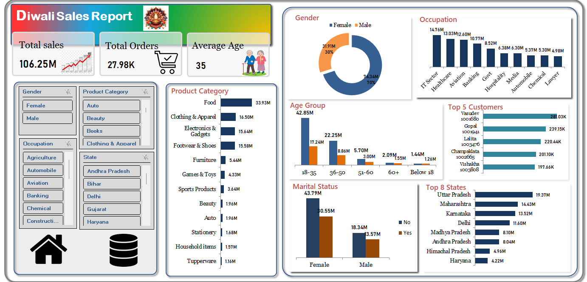

# Diwali Sales Analysis 🪔

A comprehensive data analysis project exploring sales patterns and customer behavior during the Diwali festival season using multiple analytical tools and techniques.



## Table of Contents

- [Project Overview](#project-overview)
- [Dataset Description](#dataset-description)
- [Technologies Used](#technologies-used)
- [Project Structure](#project-structure)
- [Setup and Installation](#setup-and-installation)
- [Analysis Workflow](#analysis-workflow)
- [Key Findings](#key-findings)
- [Business Recommendations](#business-recommendations)
- [Usage Instructions](#usage-instructions)
- [Future Enhancements](#future-enhancements)
- [Contributors](#contributors)

## Project Overview

This project analyzes Diwali sales data to uncover valuable insights about customer purchasing behavior during the festival season. The analysis explores relationships between demographics (gender, age, marital status), geography, occupation, and product categories to inform business decision-making.

### Objectives

1. **Data Cleaning & Preparation** - Process raw sales data using SQL and Python
2. **Exploratory Data Analysis** - Identify patterns and trends in customer behavior
3. **Visualization** - Create interactive dashboards using Power BI and Excel
4. **Business Intelligence** - Generate actionable insights for marketing and inventory strategies

## Dataset Description

The dataset contains **11,253 sales records** with the following attributes:

| Column             | Description                                                       |
| ------------------ | ----------------------------------------------------------------- |
| `User_ID`          | Unique customer identifier                                        |
| `Cust_name`        | Customer name                                                     |
| `Product_ID`       | Unique product identifier                                         |
| `Gender`           | Customer gender (M/F)                                             |
| `Age_Group`        | Age categories (0-17, 18-25, 26-35, 36-45, 46-50, 51-55, 55+)     |
| `Age`              | Actual age of customer                                            |
| `Marital_Status`   | Marital status (0=Unmarried, 1=Married)                           |
| `State`            | Customer's state/location                                         |
| `Zone`             | Geographical zone (Central, Eastern, Northern, Southern, Western) |
| `Occupation`       | Customer's profession                                             |
| `Product_Category` | Product category                                                  |
| `Orders`           | Number of orders placed                                           |
| `Amount`           | Purchase amount in INR                                            |

## Technologies Used

- **Python** 🐍
  - pandas, numpy (Data manipulation)
  - matplotlib, seaborn (Data visualization)
  - Jupyter Notebook (Analysis environment)
- **SQL** 🗃️
  - Data cleaning and preprocessing
  - Duplicate removal and standardization
- **Power BI** 📊
  - Interactive dashboard creation
  - Advanced visualizations
- **Excel** 📈
  - Initial data exploration
  - Dashboard creation

## Project Structure

```
DiwaliSalesAnalysis/
├── Diwali Sales Data.csv                      # Raw dataset
├── Diwali Sales Analysis Python.ipynb        # Python analysis notebook
├── Diwali Sales SQL Data Cleaning.sql        # SQL data cleaning script
├── Diwali Sales Data Dashboard.xlsx          # Excel dashboard
├── Diwali Sales Analysis PowerBI Dashboard.pbix  # Power BI dashboard
├── Diwali Sales Analysis.pdf                 # Analysis report
├── ReadMe.md                                  # Project documentation
└── Images/
    └── Dashboard.png                          # Dashboard screenshot
```

## Setup and Installation

### Prerequisites

- Python 3.7+
- Jupyter Notebook
- SQL Server or compatible database
- Microsoft Excel
- Power BI Desktop

### Python Dependencies

```bash
pip install pandas numpy matplotlib seaborn jupyter
```

### Getting Started

1. Clone the repository
2. Install required Python packages
3. Open `Diwali Sales Analysis Python.ipynb` in Jupyter Notebook
4. Load the dataset: `Diwali Sales Data.csv`
5. Run the analysis cells sequentially

## Analysis Workflow

### 1. Data Cleaning (SQL + Python)

- **Removed irrelevant columns**: `Status`, `unnamed1`
- **Handled missing values**: Replaced null amounts with mean values
- **Standardized data**:
  - Gender: F → Female, M → Male
  - Marital Status: 0 → No, 1 → Yes
- **Removed duplicates**: Eliminated 64 duplicate records
- **Created age groups**: Binned ages into meaningful categories

### 2. Exploratory Data Analysis (Python)

- **Demographic Analysis**: Gender, age group, marital status distribution
- **Geographic Analysis**: State-wise sales performance
- **Occupational Analysis**: Profession-based purchasing patterns
- **Product Analysis**: Category performance and top-selling items
- **Customer Segmentation**: Identified high-value customers

### 3. Visualization (Power BI + Excel)

- Interactive dashboards with drill-down capabilities
- Filters for demographic and geographic segments
- KPI cards for key metrics
- Trend analysis charts

## Key Findings

### 👥 Demographics

- **Gender**: Females account for **higher purchase volume and spending**
- **Age Group**: **26-35 years** is the primary customer segment
- **Marital Status**: **Unmarried customers** tend to spend more during festivals

### 📍 Geography

- **Top States**: Uttar Pradesh, Maharashtra, Karnataka lead in orders and sales
- **Regional Pattern**: Southern and Western zones show strong performance

### 💼 Occupation

- **Top Spenders**: IT Sector, Healthcare, Aviation, and Banking professionals
- **Pattern**: White-collar professionals show higher purchasing power

### 🛍️ Products

- **Popular Categories**: Food and Clothing dominate festival purchases
- **Insight**: Customers order more clothing items but spend more on food
- **Hero Products**: Specific product IDs show exceptional performance

### 💰 Financial Insights

- **Average Order Value**: Calculated and analyzed across segments
- **Price Sensitivity**: Analyzed through price binning (Low, Medium, High)
- **Customer Lifetime Value**: Identified top customers by total spending

## Business Recommendations

### 🎯 Marketing Strategy

1. **Target Female Customers** (26-35 age group) with personalized campaigns
2. **Focus on IT and Healthcare professionals** with premium offerings
3. **Leverage unmarried customer segment** with exclusive festival deals

### 🌍 Geographic Expansion

1. **Strengthen presence** in Uttar Pradesh, Maharashtra, Karnataka
2. **Develop strategies** for underperforming regions
3. **Zone-wise customization** of product offerings

### 📦 Inventory Management

1. **Stock up on Food and Clothing** categories before festival season
2. **Promote underperforming categories** (Tupperware, Stationery) through bundles
3. **Optimize hero product availability** based on demand patterns

### 🤝 Customer Retention

1. **Implement loyalty programs** for high-value customers
2. **Create retention strategies** for top spenders
3. **Develop age-group specific** offerings and communications

## Usage Instructions

### Python Analysis

```python
# Load the notebook
jupyter notebook "Diwali Sales Analysis Python.ipynb"

# Key analysis sections:
# 1. Data Loading & Cleaning
# 2. Gender Analysis
# 3. Age Group Analysis
# 4. Geographic Analysis
# 5. Occupation Analysis
# 6. Product Category Analysis
# 7. Customer Analysis
```

### SQL Data Cleaning

```sql
-- Execute the SQL script to clean data
-- Key operations:
-- 1. Drop irrelevant columns
-- 2. Standardize gender values
-- 3. Handle missing amounts
-- 4. Remove duplicates
-- 5. Create age groups
```

### Dashboard Usage

- **Power BI**: Open `.pbix` file for interactive exploration
- **Excel**: Use pivot tables and charts for quick insights
- **Filters**: Apply demographic, geographic, and product filters

## Future Enhancements

- [ ] **Time Series Analysis**: Add temporal patterns analysis
- [ ] **Predictive Modeling**: Customer lifetime value prediction
- [ ] **Market Basket Analysis**: Product association rules
- [ ] **Sentiment Analysis**: Customer feedback analysis
- [ ] **Real-time Dashboard**: Live data integration
- [ ] **Machine Learning**: Customer segmentation using clustering
- [ ] **Mobile Dashboard**: Responsive design for mobile devices

---

### 📊 Project Statistics

- **Dataset Size**: 11,253 records
- **Features Analyzed**: 13 key attributes
- **Visualizations Created**: 15+ charts and graphs
- **Tools Used**: 4 different analytical platforms
- **Business Insights**: 12 actionable recommendations

**Last Updated**: September 2025
